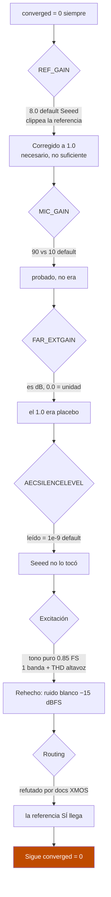
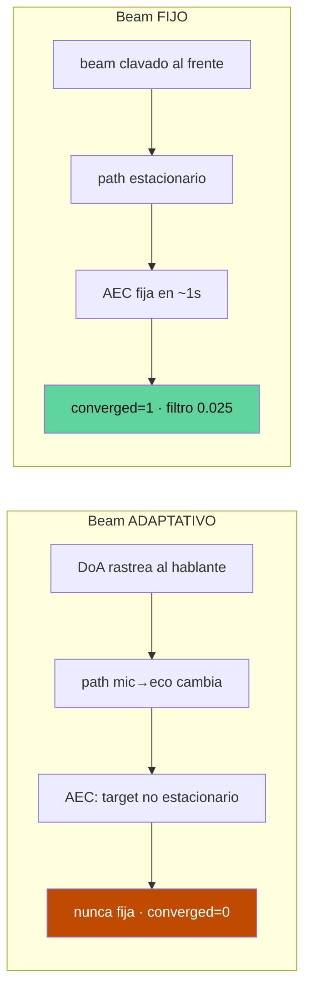
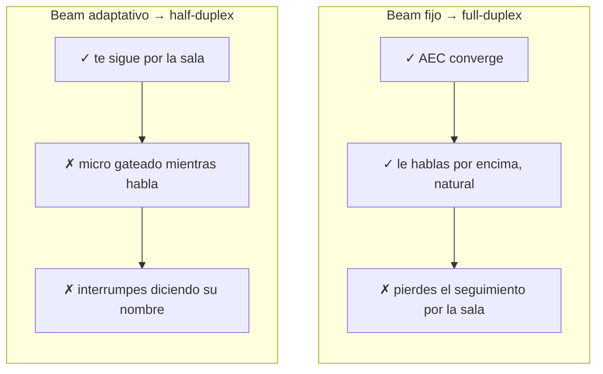

# Por qué el cancelador de eco no convergía — y cómo un beam fijo desbloqueó el full-duplex

> Serie técnica de **Zetesis** sobre **Sebastian**, nuestro altavoz conversacional
> sobre ReSpeaker XVF3800 + XIAO ESP32-S3. Este post es una *war story* de
> depuración de audio far-field a bajo nivel.

## El problema: un altavoz que se escucha a sí mismo

Un altavoz de voz tiene un conflicto físico de base: el micrófono y el altavoz
viven en la misma caja, a centímetros. Cuando el agente habla, su propia voz
vuelve al micro con una amplitud enorme comparada con la del usuario. Sin
cancelación, esa voz regresa al ASR como **turnos fantasma** nítidos: el agente
se responde a sí mismo y la sala se realimenta.

La solución de libro es el **AEC** (Acoustic Echo Canceller): un filtro adaptativo
que estima el camino acústico altavoz→micro y resta el eco. El XVF3800 (XMOS
VocalFusion) trae uno en silicio. El problema: **no convergía nunca**.


El síntoma medido: `AECCONVERGED` (registro `33/3` del XVF) se quedaba en **0 de
por vida** (el flag está *latched*; una vez a 1 no baja hasta un power-cycle
completo — `esp_restart` no reinicia el XVF).

## El protocolo de control: hablar con el DSP por I2C

Todo el diagnóstico se hizo por el `device_control` del XVF sobre I2C desde el
firmware en Zig:

```
write  [resid, cmd | 0x80, n+1]     # 0x80 = READ bit
read   n+1 bytes                    # byte 0 = status (0 OK, 0x40 retry), resto = payload LE
```

Con eso se leen/escriben todos los parámetros del AEC. Empezamos eliminando
sospechosos de configuración, uno a uno.

## La eliminación sistemática



Los hallazgos concretos, con registros:

- **`REF_GAIN` (`35/1`)**: lineal, default XMOS `1.5`, pero el build de Seeed lo
  envía a `8.0`. A full-scale, ×8 **clippea digitalmente la referencia interna**
  del AEC → el filtro lineal no puede correlar. Bug real, corregido a `1.0`.
  **Necesario pero no suficiente.**
- **`MIC_GAIN` (`35/0`)**: `90` vs `10` default (regla XMOS: el mic ≥6 dB por
  debajo de la referencia). Probado, no era la causa.
- **`FAR_EXTGAIN` (`33/5`)**: es **dB**, no lineal → `0.0` = unidad es lo
  correcto; el `1.0` que arrastrábamos era un placebo de un diagnóstico erróneo.
- **`AECSILENCELEVEL` (`33/2`)**: leído = `1e-9`, el default. Seeed no lo subió.
- **La excitación**: la primera sonda usaba un **tono puro a 0.85 FS** — una sola
  banda + la distorsión no lineal del altavoz (THD que el AEC lineal no modela) →
  `converged=0` falso. Rehecha con **ruido blanco (xorshift) a −15 dBFS**, que es
  el estímulo de convergencia real de XMOS (banda ancha, región lineal).
- **El "routing problem"**: un diagnóstico intermedio afirmó que la referencia
  far-end nunca llegaba al AEC. **Falso**, refutado con los docs primarios de
  XMOS: `AEC_CURRENT_IDLE_TIME` (`33/77`) es un **contador de profiling de CPU**
  (ticks de 10 ns), no actividad far-end; el mux `far_end_w_gain` que la sonda
  leía **ES** la entrada del AEC.

Con `REF_GAIN=1.0` + ruido blanco + todo lo demás en su sitio: **seguía sin
converger**. Se acabaron los knobs.

## El instrumento definitivo: leer los coeficientes del filtro

Cuando no quedan parámetros que tocar, hay que mirar *dentro* del filtro. El XVF
expone los coeficientes del AEC por unos comandos ocultos:

```
FAR_MIC_INDEX (33/90)   # trigger: par (far, mic)
FILTER_LENGTH (33/93)   # nº de taps
loop: COEFF_START_OFFSET (33/91) + COEFFS (33/92, 15 floats/lectura)
FILTER_ABORT  (33/94)   # liberar el snapshot del DSP
```

Leyendo los taps tras 90 s de ruido:

- El filtro **NO estaba plano** → el AEC **sí adapta**.
- El pico estaba en el **índice ~38–64, no en 0** → adapta **causalmente**
  (descarta routing *y* delay).
- **Pero** el pico nunca pasaba de **~0.003** (el eco es ~2.5% de la referencia →
  el pico convergido debería rondar `0.025`, 8× más) y su índice **jitteaba**
  (38↔62↔64). `ref_gaps=0` → ni huecos ni convergencia lenta.

Traducción: **el AEC adapta, pero no consigue fijar un modelo estable del eco.**
El objetivo se movía debajo de sus pies.

## La hipótesis — y el breakthrough

El sospechoso: el **beamformer adaptativo**. El XVF rastrea la fuente (DoA); al
re-orientarse, cambia continuamente la función de transferencia mic→eco. El AEC
tiene un **target no estacionario** que nunca puede fijar.

La prueba: **congelar el beam** antes del ruido.

```
AEC_FIXEDBEAMSONOFF   (33/37) = 1
AEC_FIXEDBEAMSAZIMUTH (33/81) = 0 rad (al frente)
AEC_FIXEDBEAMSELEVATION (33/82) = 0
```

Resultado, **reproducible en dos runs idénticos**:

| Métrica | Beam adaptativo | Beam **FIJO** |
|---|---|---|
| `AECCONVERGED` | 0 (jamás) | **1** |
| `converged_at` | −1 (nunca en 90 s) | **1 segundo** |
| pico del filtro | ~0.003, jitteando | **0.024–0.032, estable** |
| `path_change` | — | **0** (path estacionario) |
| taps no-cero | escuálido | **345–399** |



**El beamformer adaptativo era la causa raíz.** No era un límite de hardware ni un
knob mal puesto: era una configuración de la que nadie había tirado.

## El trade-off honesto

Full-duplex desbloqueado, pero con letra pequeña:



Para un altavoz de sobremesa, un beam fijo a la zona de uso suele bastar. Y el
`config.full_duplex` **falla cerrado**: si el AEC no queda garantizado (el beam
no se fija de verdad, verificado por readback), el firmware cae a half-duplex en
vez de abrir el micro sobre un eco sin cancelar.

## Lo que queda

El full-duplex **con tracking** simultáneo — que te siga por la sala *y* cancele
el eco a la vez — sigue pendiente. Los dos caminos abiertos:

1. **Canal comms del XVF** (LEFT): tiene supresor residual **no lineal** que no
   necesita el AEC lineal convergido; podría dar full-duplex con beam adaptativo.
2. **Congelar el beam solo durante la adaptación** y reabrirlo después.

Y una parte es **física**: mic-array y altavoz en la misma caja. El eco no
estacionario es en parte diseño acústico — donde los Echo comerciales invierten
en aislamiento y geometría.

---

*Todo el diagnóstico se hizo en remoto, con auto-tests de ruido en el propio
device leídos por telemetría — pero esa es otra historia
([post 3](./blog-3-desarrollo-con-ia-y-telemetria.md)).*
