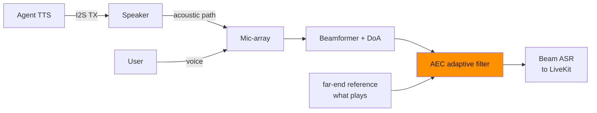
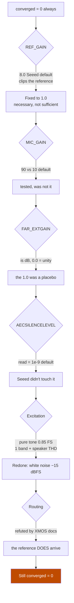
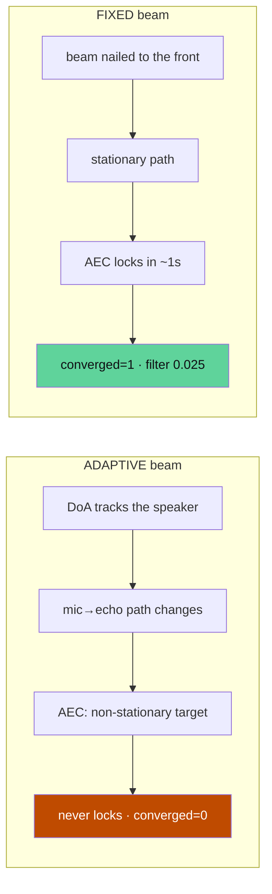
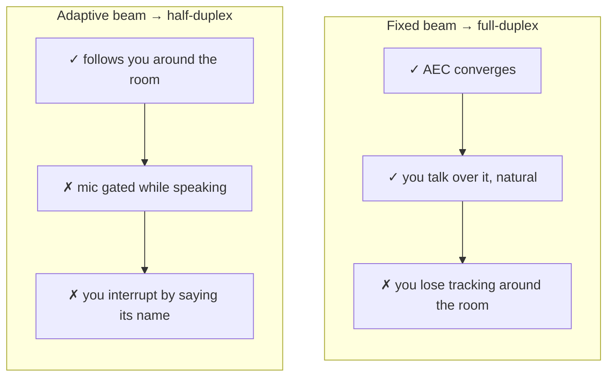

# Why the echo canceller never converged — and how a fixed beam unlocked full-duplex

> **Zetesis** technical series on **Sebastian**, our conversational speaker
> running on ReSpeaker XVF3800 + XIAO ESP32-S3. This post is a *war story* of
> low-level far-field audio debugging.

## The problem: a speaker that hears itself

A voice speaker has a fundamental physical conflict: the microphone and the speaker
live in the same box, centimeters apart. When the agent speaks, its own voice
returns to the mic with enormous amplitude compared to the user's. Without
cancellation, that voice returns to the ASR as crisp **phantom turns**: the agent
answers itself and the room feeds back.

The textbook solution is the **AEC** (Acoustic Echo Canceller): an adaptive filter
that estimates the acoustic path speaker→mic and subtracts the echo. The XVF3800 (XMOS
VocalFusion) brings one in silicon. The problem: **it never converged**.



The measured symptom: `AECCONVERGED` (XVF register `33/3`) stayed at **0 for
life** (the flag is *latched*; once at 1 it does not go down until a complete
power-cycle — `esp_restart` does not restart the XVF).

## The control protocol: talking to the DSP over I2C

All diagnostics were done through the XVF's `device_control` over I2C from the
Zig firmware:

```
write  [resid, cmd | 0x80, n+1]     # 0x80 = READ bit
read   n+1 bytes                    # byte 0 = status (0 OK, 0x40 retry), rest = payload LE
```

With that, all AEC parameters are read/written. We started by eliminating
configuration suspects, one by one.

## The systematic elimination



The concrete findings, with registers:

- **`REF_GAIN` (`35/1`)**: linear, XMOS default `1.5`, but the Seeed build
  sends it to `8.0`. At full-scale, ×8 **digitally clips the internal reference**
  of the AEC → the linear filter cannot correlate. Real bug, fixed to `1.0`.
  **Necessary but not sufficient.**
- **`MIC_GAIN` (`35/0`)**: `90` vs `10` default (XMOS rule: the mic ≥6 dB
  below the reference). Tested, was not the cause.
- **`FAR_EXTGAIN` (`33/5`)**: is **dB**, not linear → `0.0` = unity is
  correct; the `1.0` we carried over was a placebo from a wrong diagnosis.
- **`AECSILENCELEVEL` (`33/2`)**: read = `1e-9`, the default. Seeed didn't raise it.
- **The excitation**: the first probe used a **pure tone at 0.85 FS** — a single
  band + the non-linear distortion of the speaker (THD that the linear AEC does not model) →
  false `converged=0`. Redone with **white noise (xorshift) at −15 dBFS**, which is
  the real convergence stimulus of XMOS (wideband, linear region).
- **The "routing problem"**: an intermediate diagnosis claimed that the far-end
  reference never reached the AEC. **False**, refuted with the primary XMOS
  docs: `AEC_CURRENT_IDLE_TIME` (`33/77`) is a **CPU profiling counter**
  (10 ns ticks), not far-end activity; the mux `far_end_w_gain` that the probe
  was reading **IS** the AEC input.

With `REF_GAIN=1.0` + white noise + everything else in place: **it still wouldn't
converge**. We ran out of knobs.

## The ultimate instrument: reading the filter coefficients

When there are no parameters left to touch, you have to look *inside* the filter. The XVF
exposes the AEC coefficients via some hidden commands:

```
FAR_MIC_INDEX (33/90)   # trigger: pair (far, mic)
FILTER_LENGTH (33/93)   # number of taps
loop: COEFF_START_OFFSET (33/91) + COEFFS (33/92, 15 floats/read)
FILTER_ABORT  (33/94)   # free the DSP snapshot
```

Reading the taps after 90 s of noise:

- The filter **was NOT flat** → the AEC **does adapt**.
- The peak was at **index ~38–64, not at 0** → it adapts **causally**
  (rules out routing *and* delay).
- **But** the peak never went past **~0.003** (the echo is ~2.5% of the reference →
  the converged peak should be around `0.025`, 8× more) and its index **jittered**
  (38↔62↔64). `ref_gaps=0` → neither gaps nor slow convergence.

Translation: **the AEC adapts, but fails to lock onto a stable model of the echo.**
The target was moving under its feet.

## The hypothesis — and the breakthrough

The suspect: the **adaptive beamformer**. The XVF tracks the source (DoA); by
re-orienting itself, it continuously changes the mic→echo transfer function. The AEC
has a **non-stationary target** that it can never lock onto.

The test: **freeze the beam** before the noise.

```
AEC_FIXEDBEAMSONOFF   (33/37) = 1
AEC_FIXEDBEAMSAZIMUTH (33/81) = 0 rad (to the front)
AEC_FIXEDBEAMSELEVATION (33/82) = 0
```

Result, **reproducible in two identical runs**:

| Metric | Adaptive beam | **FIXED** beam |
|---|---|---|
| `AECCONVERGED` | 0 (never) | **1** |
| `converged_at` | −1 (never in 90 s) | **1 second** |
| filter peak | ~0.003, jittering | **0.024–0.032, stable** |
| `path_change` | — | **0** (stationary path) |
| non-zero taps | sparse | **345–399** |



**The adaptive beamformer was the root cause.** It wasn't a hardware limit or a
misplaced knob: it was a configuration no one had pulled.

## The honest trade-off

Full-duplex unlocked, but with fine print:



For a desktop speaker, a fixed beam to the use area is usually enough. And the
`config.full_duplex` **fails closed**: if the AEC is not guaranteed (the beam
is not truly fixed, verified by readback), the firmware falls back to half-duplex instead
of opening the mic over an uncancelled echo.

## What remains

Simultaneous full-duplex **with tracking** — following you around the room *and* cancelling
the echo at the same time — remains pending. The two open paths:

1. **XVF comms channel** (LEFT): it has a **non-linear** residual suppressor that does not
   need the converged linear AEC; it could provide full-duplex with an adaptive beam.
2. **Freeze the beam only during adaptation** and reopen it afterwards.

And a part is **physical**: mic-array and speaker in the same box. The non-stationary
echo is partly acoustic design — where commercial Echos invest
in isolation and geometry.

---

*All diagnostics were done remotely, with noise self-tests on the device itself
read by telemetry — but that is another story
([post 3](./blog-3-desarrollo-con-ia-y-telemetria.md)).*
