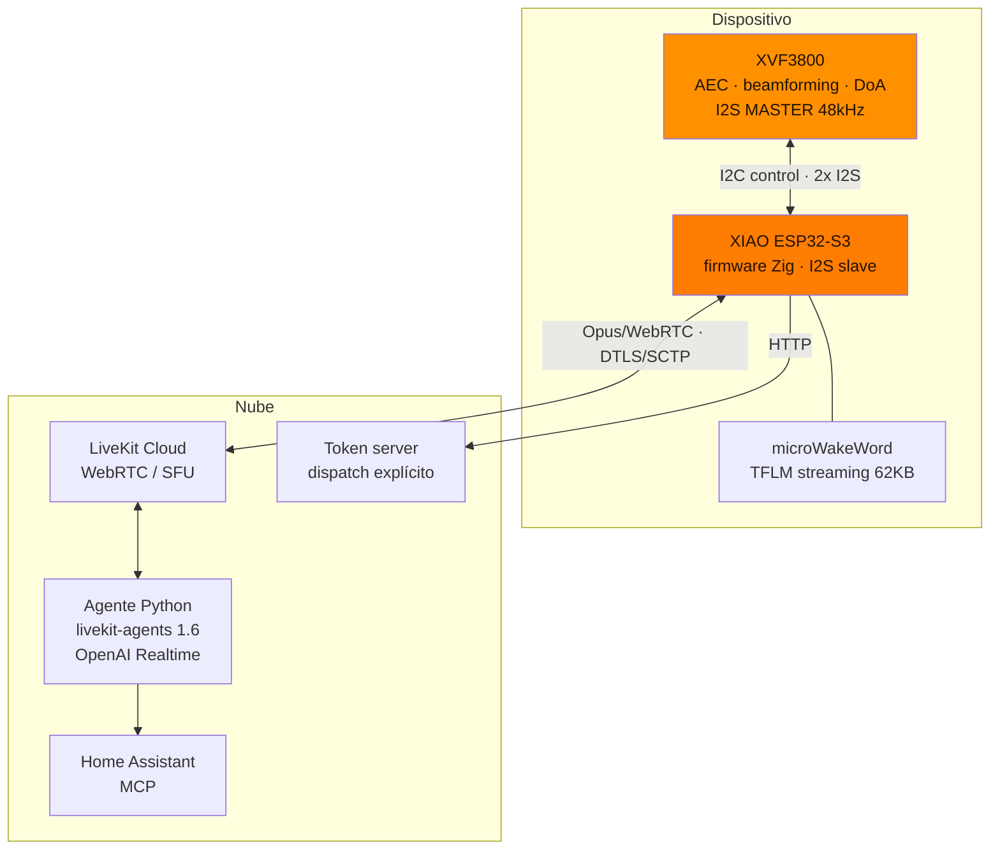
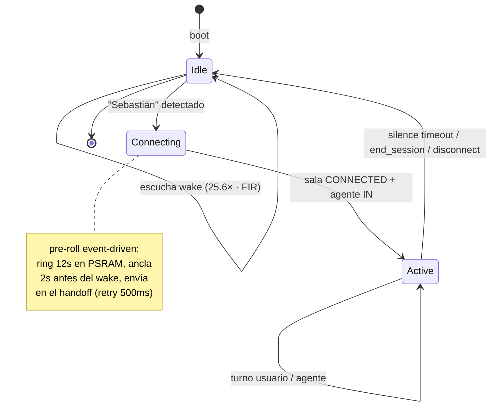

# Un altavoz conversacional en un ESP32-S3: Zig, I2S a pelo y LiveKit

> Serie técnica de **Zetesis** sobre **Sebastian**. Este post es el "cómo está
> hecho": la arquitectura del firmware y las decisiones de bajo nivel.

Sebastian es un altavoz de voz de conversación natural corriendo en un
**XIAO ESP32-S3** (240 MHz, 8 MB flash, 8 MB PSRAM octal) con un
**ReSpeaker XVF3800** (XMOS VocalFusion) haciendo el trabajo sucio de audio
far-field, hablando con **LiveKit Cloud** por WebRTC y un agente Python con
**OpenAI Realtime**. Sin nube propia de audio, sin DSP en el S3: el S3 orquesta.

## Vista de conjunto

## Por qué Zig (y no ESPHome, ni `@cImport`)

El firmware es **Zig sobre ESP-IDF v5.4** + el **LiveKit C SDK** (`client-sdk-esp32`,
en Developer Preview). Decisiones:

- **No ESPHome.** ESPHome es declarativo y no llega a este nivel de control del
  I2S, el DFU del XVF, o el pipeline de captura. Necesitábamos C-nivel.
- **Bindings `extern` a mano en `csdk.zig`, no `@cImport`.** `@cImport` sobre los
  headers de esp-idf arrastra tipos gigantes (p. ej. `esp_http_client_config_t`) y
  peta translate-c. Declaramos solo lo que usamos como `extern fn`, y donde el API
  C es más ergonómico dejamos **shims C finos** (`token_http.c`, `provisioning.c`)
  llamados desde Zig.
- **Trampa Zig cazada en campo:** `@min(comptime, x)` **estrecha el tipo del
  resultado** al rango del valor (u9 con 480) → overflow aguas abajo. Cinco
  crashes idénticos. Regla: reproducir la lógica pura en host con el zig del
  toolchain antes de flashear. Igual con `@intFromFloat` sobre floats que vienen
  de lecturas I2C: un valor basura reinició el device mid-sesión → guardas NaN /
  clamp obligatorias.

## El I2S: dos puertos, un reloj, cero ring buffer

El XVF es **I2S master a 48 kHz**; el S3 es esclavo. Se usan **dos puertos I2S
separados** (RX e TX) que comparten BCLK/WS. El XVF saca **estéreo 32-bit**:

- **slot LEFT** = beam *comms* (AEC + beamforming + NS + de-reverb + limiter).
- **slot RIGHT** = beam *ASR* crudo (post-AEC, sin post-procesado).

Qué slot consumimos es una decisión de instalación resuelta en *comptime*
(`config.mic_channel`).

La decisión de diseño que más costó: **`mic_src` lee el I2S dentro del propio
`read_frame`** del pipeline de captura (consumer-paced). Nada de tarea productora
+ ring buffer. Un ring buffer de rueda libre metía un **"helicóptero"/warble
periódico** por drift entre dominios de reloj. Al leer bajo demanda, el reloj de
48 kHz del XVF y el consumidor de LiveKit **son el mismo bucle** — drift cero.

## Wake word: la decimación que casi lo mata

El modelo (**microWakeWord**, streaming TFLM de 62 KB, tensores `[1,2,40]` con
`MicroResourceVariables`) quiere **16 kHz mono**; el XVF da **48 kHz**. Hay que
decimar 3:1. El detalle que costó una tarde: **el FIR anti-aliasing NO es
opcional**. Sin él, coger-uno-de-cada-tres pliega la energía >8 kHz (sibilantes,
ruido de sala) sobre el espectro y el modelo **colapsa a ~0% con voz en vivo**
(aunque funcione con TTS de banda limitada). Con FIR: recall 99.3%. Además,
`pymicro-features` escala por **25.6** — otro número mágico que no se puede omitir.

## La máquina de estados: wake gatea la sesión

En reposo el coste es cero (sin LiveKit). El wake word gatea todo:

Detalles que costaron sesiones:

- **Dispatch explícito por token.** La `RoomConfiguration` del token **se ignora
  si la sala ya existe** — esa era la causa del "no responde tras re-wake". Cada
  token trae su dispatch del agente por API.
- **Pre-roll event-driven, no por temporizador.** El handoff wake→live es un
  **evento** (sala CONNECTED + agente dentro), no un `sleep(N)`: el ring de 12 s
  en PSRAM se congela y se manda cuando la sala está lista, con reintento cada
  500 ms. Así no se pierde lo que dijiste mientras `token.fetch()` corría.
- **Half-duplex / full-duplex / LINGER / barge-in / keepalive** — el modelo de
  turno vive en el firmware, espejado en el agente por un data channel
  (`sebastian.agent_state`). El **keepalive** es fino: toma el *reference-output
  callback* de `av_render` (`int(*)(uint8_t*,int,void*)` — el PCM que va al
  altavoz) para saber si el agente habla, **independiente del data channel** (que
  se cae). El `auto_clear_after_cb` mete ceros exactos en underrun, así que
  no-silencio = agente hablando, sin ruido de fondo que confunda.

## El agente: Realtime + grounding

El agente es `livekit-agents ~1.6` + **OpenAI Realtime** (semantic VAD). Detecta
turnos, interrumpe, y tiene un **tool `end_session`** por voz. Grounding contra
**Home Assistant vía MCP** con anti-alucinación (obligado a consultar el estado
real de la casa antes de responder).

## En una frase

El audio far-field (XVF3800) y el transporte (LiveKit/WebRTC) ya existían; el
trabajo fue **el pegamento de bajo nivel**: I2S sin drift, DFU del XVF por I2C,
decimación con FIR, un modelo de invocación event-driven, y un firmware Zig que
no se cae. La conversación bidireccional funciona; lo que falta para "nivel Echo"
está en el [roadmap](./ROADMAP.md).

---

*El eco y el full-duplex tienen su propia guerra en el
[post 1](./blog-1-aec-full-duplex.md). Cómo depuramos todo esto en remoto, en el
[post 3](./blog-3-desarrollo-con-ia-y-telemetria.md).*
