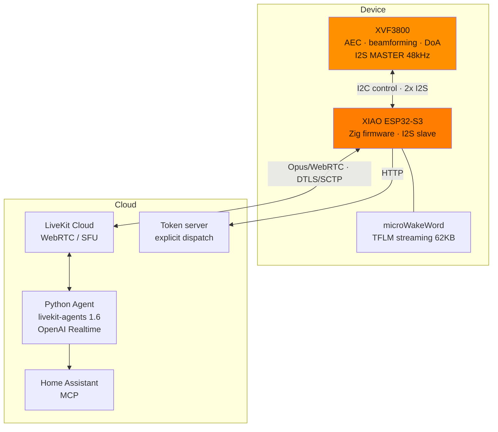
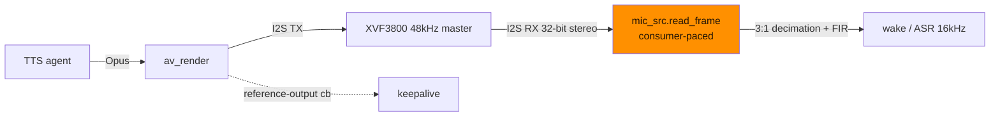
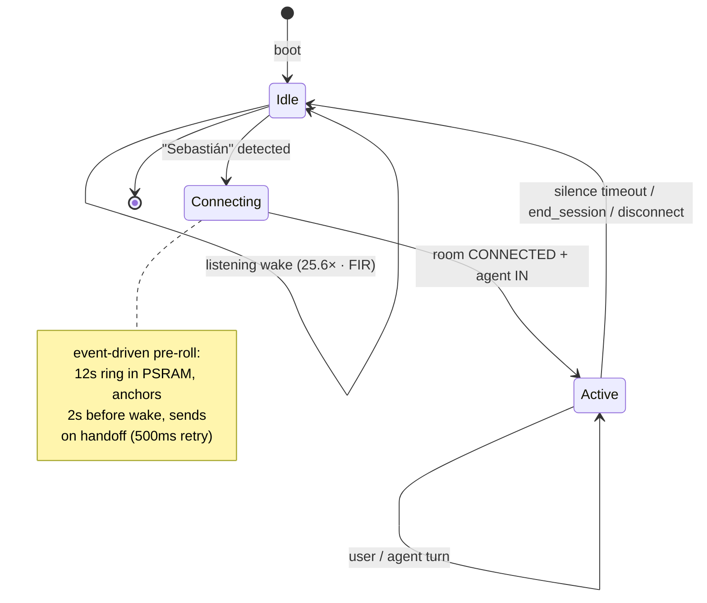

# A conversational speaker on an ESP32-S3: Zig, raw I2S and LiveKit

> Technical series from **Zetesis** about **Sebastian**. This post is the "how it's made": the firmware architecture and low-level decisions.

Sebastian is a natural conversation voice speaker running on a **XIAO ESP32-S3** (240 MHz, 8 MB flash, 8 MB octal PSRAM) with a **ReSpeaker XVF3800** (XMOS VocalFusion) doing the dirty work of far-field audio, talking to **LiveKit Cloud** via WebRTC and a Python agent with **OpenAI Realtime**. No custom audio cloud, no DSP on the S3: the S3 orchestrates.

## Overview

## Why Zig (and not ESPHome, or `@cImport`)

The firmware is **Zig on ESP-IDF v5.4** + the **LiveKit C SDK** (`client-sdk-esp32`, in Developer Preview). Decisions:

- **No ESPHome.** ESPHome is declarative and does not reach this level of control of the I2S, the XVF's DFU, or the capture pipeline. We needed C-level.
- **Manual `extern` bindings in `csdk.zig`, not `@cImport`.** `@cImport` over the esp-idf headers pulls in giant types (e.g. `esp_http_client_config_t`) and crashes translate-c. We declare only what we use as `extern fn`, and where the C API is more ergonomic we leave **thin C shims** (`token_http.c`, `provisioning.c`) called from Zig.
- **Zig trap caught in the field:** `@min(comptime, x)` **narrows the result type** to the value range (u9 with 480) → downstream overflow. Five identical crashes. Rule: reproduce pure logic on the host with the toolchain's zig before flashing. Same with `@intFromFloat` on floats coming from I2C reads: a garbage value rebooted the device mid-session → mandatory NaN / clamp guards.

## The I2S: two ports, one clock, zero ring buffer

The XVF is **I2S master at 48 kHz**; the S3 is a slave. **Two separate I2S ports** (RX and TX) are used, sharing BCLK/WS. The XVF outputs **32-bit stereo**:

- **LEFT slot** = beam *comms* (AEC + beamforming + NS + de-reverb + limiter).
- **RIGHT slot** = raw *ASR* beam (post-AEC, without post-processing).

Which slot we consume is an installation decision resolved at *comptime* (`config.mic_channel`).

The hardest design decision: **`mic_src` reads the I2S inside the `read_frame`** of the capture pipeline itself (consumer-paced). No producer task + ring buffer. A free-wheeling ring buffer introduced a **periodic "helicopter"/warble** due to drift between clock domains. By reading on demand, the XVF's 48 kHz clock and the LiveKit consumer **are the same loop** — zero drift.

## Wake word: the decimation that almost killed it

The model (**microWakeWord**, 62 KB TFLM streaming, `[1,2,40]` tensors with `MicroResourceVariables`) wants **16 kHz mono**; the XVF outputs **48 kHz**. We have to decimate 3:1. The detail that cost an afternoon: **the anti-aliasing FIR is NOT optional**. Without it, taking-one-out-of-every-three folds the >8 kHz energy (sibilants, room noise) over the spectrum and the model **collapses to ~0% with live voice** (even if it works with band-limited TTS). With FIR: 99.3% recall. Besides, `pymicro-features` scales by **25.6** — another magic number that cannot be omitted.

## The state machine: wake gates the session

At rest the cost is zero (no LiveKit). The wake word gates everything:

Details that cost sessions:

- **Explicit dispatch by token.** The token's `RoomConfiguration` **is ignored if the room already exists** — that was the cause of the "no response after re-wake". Each token brings its API agent dispatch.
- **Event-driven pre-roll, not timer-based.** The wake→live handoff is an **event** (room CONNECTED + agent inside), not a `sleep(N)`: the 12s ring in PSRAM is frozen and sent when the room is ready, with retries every 500 ms. That way, what you said while `token.fetch()` was running is not lost.
- **Half-duplex / full-duplex / LINGER / barge-in / keepalive** — the turn model lives in the firmware, mirrored in the agent by a data channel (`sebastian.agent_state`). The **keepalive** is subtle: it takes the *reference-output callback* from `av_render` (`int(*)(uint8_t*,int,void*)` — the PCM going to the speaker) to know if the agent is speaking, **independent of the data channel** (which can drop). The `auto_clear_after_cb` injects exact zeros on underrun, so non-silence = agent speaking, without background noise to confuse it.

## The agent: Realtime + grounding

The agent is `livekit-agents ~1.6` + **OpenAI Realtime** (semantic VAD). It detects turns, interrupts, and has a voice **`end_session` tool**. Grounding against **Home Assistant via MCP** with anti-hallucination (forced to query the real state of the house before responding).

## In a sentence

The far-field audio (XVF3800) and the transport (LiveKit/WebRTC) already existed; the work was **the low-level glue**: driftless I2S, I2C DFU for the XVF, FIR decimation, an event-driven invocation model, and a Zig firmware that does not crash. Two-way conversation works; what's missing for "Echo level" is in the [roadmap](./ROADMAP.md).

---

*Echo and full-duplex have their own war in [post 1](./blog-1-aec-full-duplex.md). How we debugged all this remotely, in [post 3](./blog-3-desarrollo-con-ia-y-telemetria.md).*
