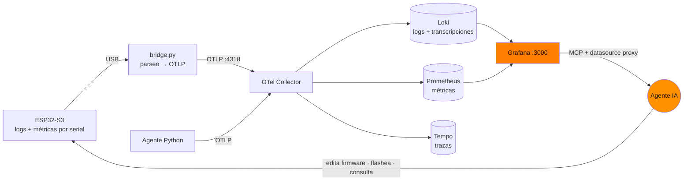
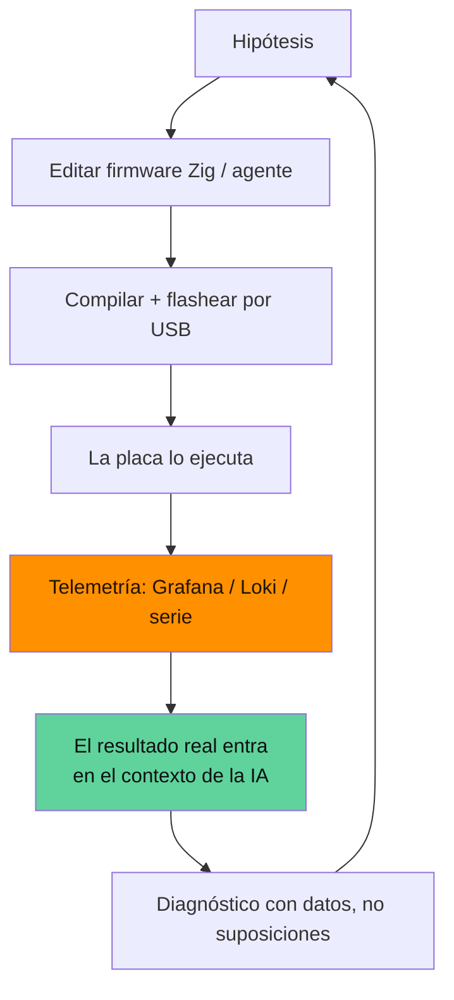
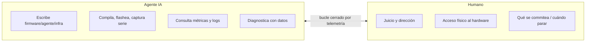

# Desarrollado con IA, depurado con telemetría: cómo le dimos ojos a un agente

> Serie técnica de **Zetesis** sobre **Sebastian**. Este post no va tanto del
> *qué* como del *cómo lo hicimos*: **Sebastian se ha desarrollado entero con un
> agente de IA** (Claude Code) — firmware Zig, agente Python, infra. Y la pieza
> que lo hizo posible fue la **observabilidad**.

## El problema de fondo: depurar algo que la IA no puede tocar

Un agente de IA escribe código de sobra. Lo que no tiene, por defecto, es **los
sentidos** para saber si ese código funciona en un cacharro físico: un ESP32-S3
con un DSP de audio, conectado por USB, en una habitación a la que la IA no puede
entrar. El bucle clásico —"cambio esto, a ver qué pasa"— se rompe: la IA no ve
qué pasa.

La solución fue montar una **pila de observabilidad** y **darle a la IA acceso
directo a ella**. Con eso, el agente cerró el bucle solo.

## La pila: serial → OTLP → Grafana

- El **`bridge.py`** lee el serial, parsea líneas de estado con regex y las empuja
  como métricas/logs por **OTLP** a un stack **LGTM** (Loki, Grafana, Tempo,
  Prometheus) en Docker.
- El **agente Python** exporta también por OTLP como `sebastian-agent`, con las
  **transcripciones por turno en Loki** — así, depurar un "no me responde" es
  literalmente **leer qué oyó**.
- Un **heartbeat** (`sebastian_serial_age_seconds`) distingue "vivo y callado" de
  "muerto/desenchufado": un gauge congelado parece sano; la edad no miente.
- La IA consulta todo con `curl` al **datasource proxy** de Grafana
  (`/api/datasources/proxy/uid/{loki,prometheus}/...`) además del MCP.

## El ciclo virtuoso: la telemetría alimenta el contexto de la IA

Lo interesante no es la pila; es lo que habilita. Cada cambio de la IA vuelve a su
contexto **como comportamiento real observado**:

No es "genera código y reza". Es **percepción→acción cerrada** sobre hardware que
la IA no ve ni toca. La observabilidad se convirtió en los **sentidos** del
agente, y el contexto se realimentó solo.

## Remoto de verdad: testear con el usuario fuera de casa

El caso extremo: parte del trabajo del AEC se hizo con el **usuario fuera de
casa**. Sin nadie que hablara al micro, la IA orquestó **auto-tests en el propio
device**: un flag (`config.probe_aec_on_boot`) hacía que el firmware **reprodujera
ruido blanco por su propio altavoz** al arrancar y reportara la convergencia del
AEC — sin sesión, sin humano. La IA disparaba el test flasheando, capturaba el
serial, y leía `converged_at`, el pico del filtro y los `ref_gaps` desde la
telemetría. Depuración de audio far-field, en remoto, sin nadie delante.

## Tres diagnósticos que solo salieron por telemetría

**1. La sesión se cortaba a mitad.** Grafana: `session silence timeout: level=650
threshold=3000 quiet_ms=12000`. El nivel de micro estaba bajísimo aunque el
agente hablaba. La ironía la reveló otra métrica, `echo: gated_peak=0`: **el AEC
funcionaba tan bien** que el micro leía silencio durante el habla del agente → el
detector de silencio cerraba la sesión. El fix (keepalive desde la salida del
altavoz) salió de *ver* esas dos métricas juntas.

**2. La tormenta SCTP.** El transporte se caía y no sabíamos por qué. En Loki, la
huella: cientos de `SCTP: Send INIT chunk` por segundo sin completar el handshake,
terminando en `SCTP_ABORT`, mientras el media (SRTP) seguía. Diagnóstico cerrado
(reportado *upstream* en `esp-webrtc-solution#186`) leyendo logs crudos.

**3. El wake poco fiable.** Los logs traen la probabilidad de cada disparo
(`prob spike: X%`). Los falsos se agrupaban **justo en el corte** (62%, 73%),
mientras los "Sebastián" reales iban a 92–98%. Subir el umbral `0.62 → 0.80` fue
una decisión **con datos de campo**, no a ojo.

## Honestidad: la IA se equivoca, y el humano dirige

Esto no es magia. Merece contarse de verdad:

- La IA dio un **diagnóstico erróneo** ("routing problem") y lo **rectificó ella
  misma** contrastando contra los **docs primarios de XMOS** — la observabilidad
  también sirvió para refutar hipótesis propias.
- El **humano dirigió las decisiones** que no son mecánicas: beam fijo vs tracking,
  qué commitear, cuándo parar. Y aportó lo único que la IA no puede: **acceso
  físico** — cuando el USB nativo del S3 se colgó, hizo falta un
  desenchufa-y-enchufa que solo hace una mano.

El reparto que funcionó:

## La tesis

Para desarrollar embebido con IA, el código es la parte fácil. La difícil es
**cerrar el bucle sobre hardware que la IA no ve**. La observabilidad no es un
extra de "producción": es el **prerrequisito** para que un agente itere de verdad.
Le das ojos, y el contexto se realimenta solo — un ciclo virtuoso donde cada
cambio se juzga por comportamiento medido, no por suposición.

Sebastian se construyó así, de punta a punta.

---

*El AEC en detalle, en el [post 1](./blog-1-aec-full-duplex.md). La arquitectura
del firmware, en el [post 2](./blog-2-arquitectura-esp32-zig-livekit.md).*
