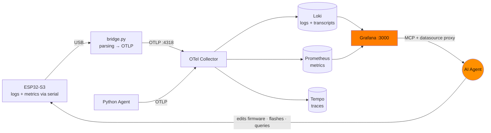
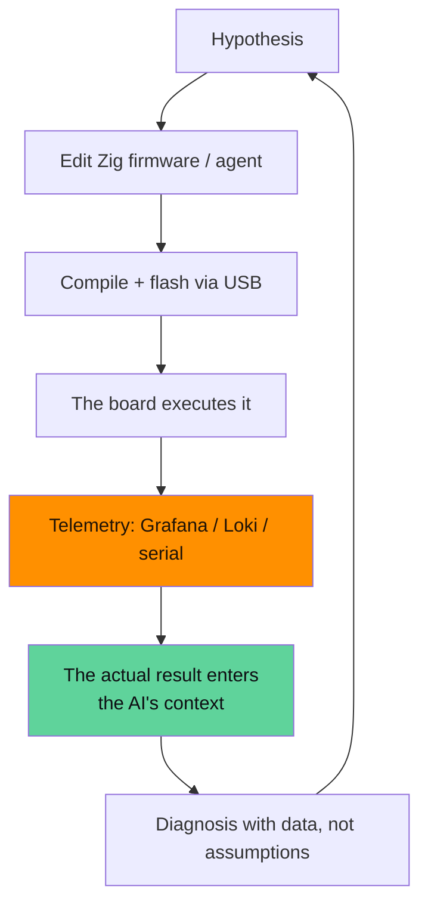
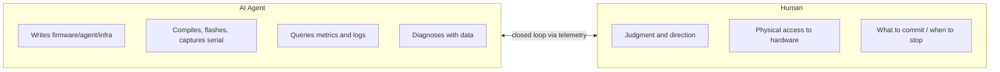

# Developed with AI, debugged with telemetry: how we gave eyes to an agent

> Technical series by **Zetesis** about **Sebastian**. This post is not so much about
> *what* as it is about *how we did it*: **Sebastian has been developed entirely with an
> AI agent** (Claude Code) — Zig firmware, Python agent, infra. And the piece
> that made it possible was **observability**.

## The underlying problem: debugging something the AI cannot touch

An AI agent writes code to spare. What it lacks, by default, is **the
senses** to know if that code works on a physical device: an ESP32-S3
with an audio DSP, connected via USB, in a room the AI cannot
enter. The classic loop —"I change this, let's see what happens"— breaks: the AI cannot see
what happens.

The solution was to set up an **observability stack** and **give the AI direct
access to it**. With that, the agent closed the loop on its own.

## The stack: serial → OTLP → Grafana

- The **`bridge.py`** reads the serial, parses state lines with regex and pushes them
  as metrics/logs via **OTLP** to an **LGTM** stack (Loki, Grafana, Tempo,
  Prometheus) in Docker.
- The **Python agent** also exports via OTLP as `sebastian-agent`, with the
  **turn transcripts in Loki** — so, debugging a "it doesn't answer me" is
  literally **reading what it heard**.
- A **heartbeat** (`sebastian_serial_age_seconds`) distinguishes "alive and quiet" from
  "dead/unplugged": a frozen gauge looks healthy; age does not lie.
- The AI queries everything with `curl` to Grafana's **datasource proxy**
  (`/api/datasources/proxy/uid/{loki,prometheus}/...`) in addition to the MCP.

## The virtuous cycle: telemetry feeds the AI's context

The interesting part is not the stack; it's what it enables. Every change by the AI returns to its
context **as actual observed behavior**:

It's not "generate code and pray". It's a **closed perception→action loop** on hardware that
the AI neither sees nor touches. Observability became the agent's **senses**,
and the context fed itself.

## Truly remote: testing with the user away from home

The extreme case: part of the AEC work was done with the **user away from
home**. With nobody to speak into the mic, the AI orchestrated **auto-tests on the
device itself**: a flag (`config.probe_aec_on_boot`) made the firmware **play
white noise through its own speaker** upon boot and report the AEC's
convergence — without a session, without a human. The AI triggered the test by flashing, captured the
serial, and read `converged_at`, the filter's peak and the `ref_gaps` from the
telemetry. Far-field audio debugging, remotely, with nobody in front of it.

## Three diagnoses that only emerged through telemetry

**1. The session was cutting off midway.** Grafana: `session silence timeout: level=650
threshold=3000 quiet_ms=12000`. The mic level was extremely low even though the
agent was speaking. The irony was revealed by another metric, `echo: gated_peak=0`: **the AEC
was working so well** that the mic read silence during the agent's speech → the
silence detector closed the session. The fix (keepalive from the speaker's
output) came from *seeing* those two metrics together.

**2. The SCTP storm.** The transport was dropping and we didn't know why. In Loki, the
fingerprint: hundreds of `SCTP: Send INIT chunk` per second without completing the handshake,
ending in `SCTP_ABORT`, while the media (SRTP) continued. Closed diagnosis
(reported *upstream* in `esp-webrtc-solution#186`) by reading raw logs.

**3. The unreliable wake.** The logs include the probability of each trigger
(`prob spike: X%`). The false positives clustered **right at the threshold** (62%, 73%),
while the real "Sebastians" were at 92–98%. Raising the threshold `0.62 → 0.80` was
a decision made **with field data**, not by guessing.

## Honesty: the AI makes mistakes, and the human directs

This is not magic. It deserves to be told truthfully:

- The AI provided an **incorrect diagnosis** ("routing problem") and **rectified it
  itself** by cross-referencing against the **primary XMOS docs** — observability
  also served to refute its own hypotheses.
- The **human directed the decisions** that are not mechanical: fixed beam vs tracking,
  what to commit, when to stop. And provided the only thing the AI cannot: **physical
  access** — when the S3's native USB hung, it required a
  plug-and-unplug that only a hand can do.

The distribution that worked:

## The thesis

For embedded development with AI, the code is the easy part. The hard part is
**closing the loop on hardware that the AI cannot see**. Observability is not a
"production" extra: it is the **prerequisite** for an agent to truly iterate.
You give it eyes, and the context feeds itself — a virtuous cycle where every
change is judged by measured behavior, not by assumption.

Sebastian was built this way, end-to-end.

---

*The AEC in detail, in [post 1](./blog-1-aec-full-duplex.md). The firmware's
architecture, in [post 2](./blog-2-arquitectura-esp32-zig-livekit.md).*
